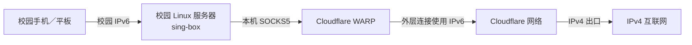

# 东北大学校园网 IPv6 方案调研与部署决策指南

本仓库整理了东北大学校园网 IPv6 相关开源项目、可行架构、校园 Linux 服务器部署记录、Windows 自建节点验证流程，以及手机和平板接入时的安全与验收要求。

> 调研快照：2026-09-08。项目活跃度、校园网计费策略和服务商产品能力都可能变化，实施前必须复核。

## 先说结论

- 利用校内 IPv6 连接校外双栈节点，再由节点访问 IPv4 互联网，在技术上可行。
- 2026-09-07 已验证另一条路线：校园设备通过 IPv6 连接校园 Linux 服务器，服务器经 IPv6 建立 WARP 隧道，再由 Cloudflare 提供 IPv4 出口。
- 2026-09-08 复测确认该服务器路线目前只可靠承载 TCP。WARP 本地 SOCKS5 不接受 UDP Associate；切换服务器 WARP 全隧道会阻断节点入站，因此不能把它直接扩展成全流量方案。
- 全 TCP/UDP 的下一步改为在 Android 端直接验证官方 Cloudflare WARP；该路线绕过校园服务器，但仍须单独确认 WARP 外层实际使用 IPv6，并完成校园账户计费 A/B 测试。
- “免流量费”不是协议自带能力，只在学校当前计费规则未对这类 IPv6 流量计费时成立，不能承诺长期免费。
- 仅有 IPv6 出站能力还不够；自建 Windows 节点必须能被校园网设备从公网 IPv6 主动访问。
- 登录校园网的工具与 IPv6 转发工具是两类软件，不应混为一谈。
- iPhone 和小米 Android 平板可以作为客户端，但最终效果取决于校园 Wi-Fi 是否分配可用 IPv6、客户端兼容性及服务端可达性。

## 推荐路线

该路线目前只完成 TCP 技术连通性验证。校园无线网段到服务器网段的 IPv6 可达性曾出现间歇中断；正式使用前仍需完成校园账户计费 A/B、地址变化和长期稳定性测试。需要全 TCP/UDP 时，不应直接开启服务器 UDP 后回退到校园 IPv4 出口。

## 文档目录

- [校园服务器 + WARP 部署记录（2026-09-07）](docs/campus-server-warp-deployment-2026-09-07.md)：当前已打通的架构、配置边界、验证证据和后续验收。
- [Windows 节点部署进展（2026-09-05）](docs/deployment-progress-2026-09-05.md)：外部 IPv6 入站阻塞及历史排查记录。
- [项目调研](docs/project-review.md)：东北大学相关项目及同类方案对比。
- [架构与选型](docs/architecture-and-options.md)：VPS、本地/公司电脑、移动端的适用条件。
- [Windows 验证指南](docs/windows-validation.md)：先验证网络，再决定是否部署。
- [Windows 原生节点](windows-node/README.md)：安装 sing-box、生成私人配置、测试入站并按登录自动启动。
- [验收清单](docs/acceptance-checklist.md)：计费、性能和稳定性的 A/B 测试方法。
- [安全说明](SECURITY.md)：凭据、暴露面和远程协助边界。
- [限制与合规](DISCLAIMER.md)：计费不确定性及组织授权要求。

## 最小成功条件

1. 手机或平板连接校园 Wi-Fi 后拥有可用 IPv6。
2. 节点拥有校园端可达的 IPv6，并具备经 IPv6 建立的可用 IPv4 出口。
3. 校园端能主动连接节点的指定 IPv6 端口。
4. 节点持续在线，防火墙仅开放必要端口。
5. A/B 测试确认校园账户计费没有异常增长。

## 不建议直接采用的做法

- 不要因为网页显示 IPv6 测试满分，就认定外部能够访问这台电脑。
- 不要把密码、私钥、验证码、订阅地址或完整公网 IP 发到 Issue、聊天或公开仓库。
- 不要直接执行来源不明的 root 脚本，或使用明文 HTTP 分发配置。
- 不要把旧项目的星标数量当作当前可用性的证明。
- 不要在未经明确授权的公司网络中搭建对外服务。

## 推荐实施顺序

当前校园 Linux 服务器路线见 `docs/campus-server-warp-deployment-2026-09-07.md`。Windows 校外节点仍可按 `docs/windows-validation.md` 验证，但其所在 5G 网络的公网 IPv6 入站尚未打通。任何正式使用都应以 `docs/acceptance-checklist.md` 的结果为准。
